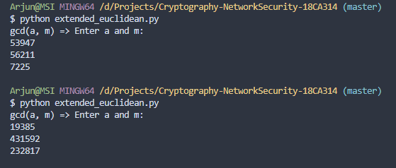

# Assignment 1

# Part A


__Z<sub>5<sub>__ 
range between 0 - 4

Multiplicative inverse of Z5 are 1, 2, 3

__Z<sub>11<sub>__
range between 0 - 10

Multiplicative inverse of Z11 are 1, 2, 3, 5, 7


__gcd(56245 & 43159)__

56245 = 1 x 43159 + 13086

43159 = 3 x 13086 + 3901

13086 = 3 x 3901 + 1383

3901 = 2 x 1383 + 1135

1383 = 1 x 1135 + 248

1135 = 4 x 248 + 143

248 = 1 x 143 + 105

143 = 1 x 105 + 38

105 = 2 x 38 + 29

38 = 1 x 29 + 9

29 = 3 x 9 + 2

9 = 4 x 2 + 1

2 = 2 x 1 + 0

hence gcd(56245 & 43159) = 1


__phi (3<sup>4</sup>) = 3<sup>4</sup> - 3<sup>4 -1</sup>__

= 3<sup>4 -1</sup>(3 - 1)

= 3<sup>4</sup>(1 - (1 / 3))

= 81 x (2 / 3) = 54

phi(2<sup>10</sup>) = 2<sup>10</sup> - 2<sup>10 - 1</sup>

= 2<sup>10 - 1</sup>(2 - 1)

= 2<sup>10</sup>(1 - (1 / 2))

= 1024 x (1 / 2) = 512


__3<sup>100</sup> mod(31319)__

100<sub>10</sub> -> (1100100)<sub>2</sub>

100 = 2<sup>6</sup> x 2<sup>5</sup> x 2<sup>2</sup>

3<sup>2<sup>6</sup> x 2<sup>5</sup> x 2<sup>2</sup></sup> mod(31319)


# Part B


```python
def ext_euc(a, b):
    s = 0
    old_s = 1
    t = 1
    old_t = 0
    r = a 
    old_r = b  
    while b != 0:
        q = a // b
        (a, b) = (b, a % b)
        (s, old_s) = ((old_s - (q * s)), s)
        (t, old_t) = ((old_s - (q * t)), t)
    if old_s < 0:
        old_s += old_r
    if old_t < 0:
        old_t += r
    return old_s

print("gcd(a, b) => Enter a and b: ")
a = int(input())
b = int(input())
print(ext_euc(a, b))
```
__Result__



---


```python
import pyDes as pd

# key = input("Enter Key: ").encode()
# data = input("Enter data to encrypt: ")
for i in range(10000000, 99999999):
    des = pd.des((str(i).encode()), pd.CBC ,b"\0\0\0\0\0\0\0\0", pad=None, padmode=pd.PAD_PKCS5)

# da = des.encrypt(data).hex()
# print("%r" %da)

    da = "4B518774A408E3E5"
    val = des.decrypt(bytes.fromhex(da))
    print("%r" %val)

```
---


```python
import random

def ext_euc(a, b):
    s = 0
    old_s = 1
    t = 1
    old_t = 0
    r = a 
    old_r = b  
    while b != 0:
        q = a // b
        (a, b) = (b, a % b)
        (s, old_s) = ((old_s - (q * s)), s)
        (t, old_t) = ((old_s - (q * t)), t)
    if old_s < 0:
        old_s += old_r
    if old_t < 0:
        old_t += r
    return old_s

def check_if_prime(val):
    if val == 2:
        return True
    if val < 2 or val % 2 == 0:
        return False
    for i in range(3, val):
        if val % i == 0:
            return False
    return True

def gcd(a, b):
    while b != 0:
        a, b = b, a % b
    return a

def main():
    print("Enter p & q :")
    p = int(input())
    q = int(input())
    msg = int(input("Enter value to be encrypted: "))
    if check_if_prime(p) and check_if_prime(q):
        n = p * q
        phi = (p - 1) * (q - 1)
        e = random.randrange(1, phi)
        g = gcd(e, phi)

        while g != 1:
            e = random.randrange(1, phi)
            g = gcd(e, phi)

        d = ext_euc(e, phi)
        print("private key: " + str(d) + " & public key " + str(e))


        c = (pow(msg, e) % n)
        print("Encrypted value is : " + str(c))

        m = pow(c, d) % n
        print("Decrypted value is : " + str(m))
                
if __name__ == '__main__':
    main()
```

